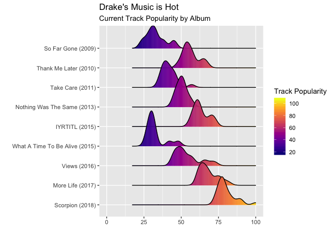
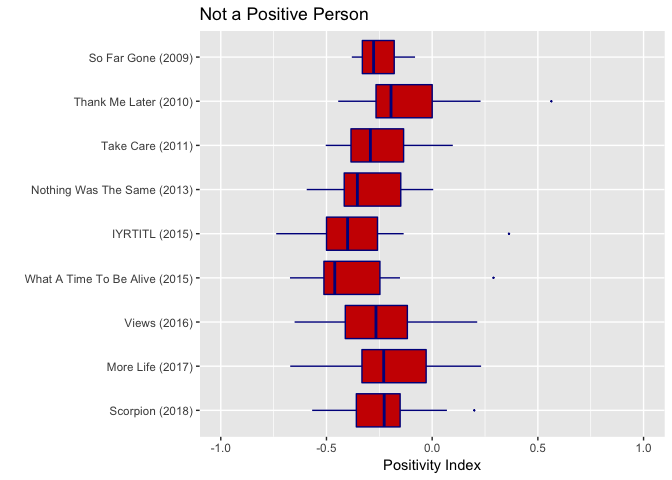
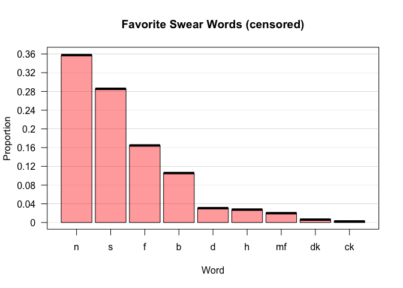
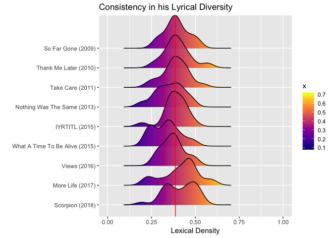

Drake - A Spotify + Genius Analysis
================
Brian Pang

### Part 1: Data Cleaning, Merge, and Variable Creation

Skip to Part 2 for analysis. Merged spotify and genius data together to add to tracks their respective lyrics. Additional variables created: scaled.afinn.score, bing.score, lexical density, word.pace, positivity index, popularity.index

``` r
#Getting data from Spotify and Genius
#Spotify
Sys.setenv(SPOTIFY_CLIENT_ID = "92d003aff9d541e09efa4538d2a835a0")
Sys.setenv(SPOTIFY_CLIENT_SECRET = "a27df42d9db74e1f998d434d64e3adb3")
access_token <- get_spotify_access_token()
spotify_df <- get_artist_audio_features('Drake')

#Genius
genius.id <- "O9Yj5AgoNZ03LRyJdiAH5a8LbGqHFCnnzp2jkjNjcIim_AcTH9u4GdYuukAyv8Uo"
genius.secret <- "ypCqIg4fUE1bXdkL-xL2yfHRWT8kja5ATTReuS-4iDxfnz7EdEccuoM25soOGz9O7hmOx_P3vjVWoUvkO0TfKw"
genius_album(artist="Drake & Future", album = "what a time to be alive")
```

    ## Joining, by = c("track_title", "track_n", "track_url")

    ## # A tibble: 810 x 4
    ##    track_title                       track_n lyric                    line
    ##    <chr>                               <int> <chr>                   <int>
    ##  1 Digital Dash (Ft. Drake & Future)       1 Metro Boomin'               1
    ##  2 Digital Dash (Ft. Drake & Future)       1 Metro Boomin' want som…     2
    ##  3 Digital Dash (Ft. Drake & Future)       1 Yeah, yeah, get it, ge…     3
    ##  4 Digital Dash (Ft. Drake & Future)       1 My dope in the bushes       4
    ##  5 Digital Dash (Ft. Drake & Future)       1 My dope in the bushes       5
    ##  6 Digital Dash (Ft. Drake & Future)       1 I know how to cook it       6
    ##  7 Digital Dash (Ft. Drake & Future)       1 My bitch good looking       7
    ##  8 Digital Dash (Ft. Drake & Future)       1 My bitch good looking       8
    ##  9 Digital Dash (Ft. Drake & Future)       1 My bitch good looking       9
    ## 10 Digital Dash (Ft. Drake & Future)       1 My dope in the bushes      10
    ## # ... with 800 more rows

``` r
genius_album(artist="Drake", album="More Life")
```

    ## Joining, by = c("track_title", "track_n", "track_url")

    ## # A tibble: 1,364 x 4
    ##    track_title track_n lyric                                          line
    ##    <chr>         <int> <chr>                                         <int>
    ##  1 Free Smoke        1 Intro: Nai Palm                                   1
    ##  2 Free Smoke        1 " &amp; "                                         2
    ##  3 Free Smoke        1 Drake                                             3
    ##  4 Free Smoke        1 Is it the strength of your feelings               4
    ##  5 Free Smoke        1 Overthrowing your pain                            5
    ##  6 Free Smoke        1 You'll see new heights you'll be reaching         6
    ##  7 Free Smoke        1 And is it today that you will find your new …     7
    ##  8 Free Smoke        1 And in your wake, ripple your sweet fate          8
    ##  9 Free Smoke        1 And more chune for your headtop                   9
    ## 10 Free Smoke        1 So watch how you speak on my name, you know?     10
    ## # ... with 1,354 more rows

``` r
lyrics_df<-data.frame()
album.names <- c("Thank Me Later","Take Care", "Nothing Was The Same","Views","Scorpion", "If You're Reading This It's Too Late",
                "So Far Gone",
                 "More Life")
for(i in 1:length(album.names)){
  lyrics_df1 <- genius_album(artist="Drake", album=album.names[i])
  lyrics_df1$Album.Name <- rep(album.names[i],nrow(lyrics_df1))
  lyrics_df <- rbind(lyrics_df, lyrics_df1)
}
```

    ## Joining, by = c("track_title", "track_n", "track_url")
    ## Joining, by = c("track_title", "track_n", "track_url")
    ## Joining, by = c("track_title", "track_n", "track_url")
    ## Joining, by = c("track_title", "track_n", "track_url")
    ## Joining, by = c("track_title", "track_n", "track_url")
    ## Joining, by = c("track_title", "track_n", "track_url")
    ## Joining, by = c("track_title", "track_n", "track_url")
    ## Joining, by = c("track_title", "track_n", "track_url")

``` r
lyrics_df1a <- genius_album(artist="Drake & Future", album = "What a time to be alive")
```

    ## Joining, by = c("track_title", "track_n", "track_url")

``` r
lyrics_df1a$Album.Name <- rep("What A Time To Be Alive", nrow(lyrics_df1a))
lyrics_df2 <- rbind(lyrics_df, lyrics_df1a)
lyrics_df3 <- (lyrics_df2 %>% group_by(track_title, Album.Name) %>% summarise(test=toString(lyric)) %>% ungroup())

names(lyrics_df3)[c(1,3)] <- c("track_name","lyrics")

#Adding songs that were missing
lyrics_df2a <- data.frame()
lyrics_df2a <- rbind(genius_lyrics(artist="Drake", song="The Motto"),genius_lyrics(artist="Drake", song="im goin in"),genius_lyrics(artist="Drake", song="fear"))
lyrics_df2b <- lyrics_df2a %>% group_by(track_title) %>% summarise(test=toString(lyric)) %>% ungroup()
lyrics_df2c <- cbind(lyrics_df2b, c("Take Care","So Far Gone", "So Far Gone"))
lyrics_df2d <- lyrics_df2c[,c(1,3,2)]
names(lyrics_df2d) <- c("track_name", "Album.Name", "lyrics")

#Lyrics from Genius
lyrics_df4 <- rbind(lyrics_df3, lyrics_df2d)
```

``` r
#Loading in Data and Variable Cleaning for A Full Join
#Have both datasets from Spotify and Genius. Going to join them on track_name. Must edit both to make the merge possible
#Albums in Analysis
levels(as.factor(spotify_df$album_name))
```

    ## [1] "If Youre Reading This Its Too Late"
    ## [2] "More Life"                         
    ## [3] "Nothing Was The Same"              
    ## [4] "Scorpion"                          
    ## [5] "So Far Gone"                       
    ## [6] "Take Care"                         
    ## [7] "Thank Me Later"                    
    ## [8] "Views"                             
    ## [9] "What A Time To Be Alive"

``` r
#levels(as.factor(lyrics_df4$Album.Name))

#Keeping column of the original names because I'm going to manipulate track names to get a clean join.
spotify_df$original_track_name <- spotify_df$track_name

#76 NA's for the join Initially
# sum(is.na(match(spotify_df$track_name, lyrics_df4$track_name)))

#1 Remove parantheses and everything inside them, forcing all to lower (removes "(feat: ...)")
string <- " \\(.+\\)"
lyrics_df4$track_name <- tolower(str_replace_all(lyrics_df4$track_name, string,""))
spotify_df$track_name <- tolower(str_replace_all(spotify_df$track_name,string,""))
# lyrics_df4

# 17 NA's Now for the join
# sum(is.na(match(spotify_df$track_name, lyrics_df4$track_name)))
#spotify_df[which(is.na(match(spotify_df$track_name,lyrics_df4$track_name))), c("track_name","album_name")]

#Making a table to compare the discrepencies...
# length(which(is.na(match(lyrics_df4$track_name,spotify_df$track_name))))
# sum(is.na(match(spotify_df$track_name, lyrics_df4$track_name)))

#Observations:
#lyrics_df4 some song names are missing punctation such as marvin's room and child's play
# lyrics_df4[which(str_detect(lyrics_df4$track_name, "")),"track_name"]
# spotify_df[which(str_detect(spotify_df$track_name, "interlude")),"track_name"]

#This was subtle... the apostrophes are different!
#One example of non-matching track names
as.character(spotify_df[61,"track_name"])
```

    ## [1] "can’t take a joke"

``` r
as.character(lyrics_df4[23,"track_name"])
```

    ## [1] "can't take a joke"

``` r
spotify_df[61,"track_name"]==lyrics_df4[23,"track_name"]
```

    ##      track_name
    ## [1,]      FALSE

``` r
"’" == "'"
```

    ## [1] FALSE

``` r
#Manual string cleaning
lyrics_df4$track_name <- str_replace(lyrics_df4$track_name, " by\\sfuture", "")
lyrics_df4$track_name <- str_replace(lyrics_df4$track_name, " by\\sdrake", "")
lyrics_df4$track_name <- str_replace(lyrics_df4$track_name, "buried alive" , "buried alive interlude")
lyrics_df4$track_name <- str_replace(lyrics_df4$track_name, "cameras", "cameras / good ones go interlude - medley")
lyrics_df4[21,3] <-paste(c(as.character(lyrics_df4[which(lyrics_df4$track_name=="cameras / good ones go interlude - medley"),3]), " ", as.character(lyrics_df4[which(lyrics_df4$track_name=="good ones go"),3]) ), collapse = ' ')
lyrics_df4$track_name <- str_replace(lyrics_df4$track_name, "\\s& michael jackson" , "")

spotify_df$track_name <- str_replace_all(spotify_df$track_name, " - album version", "")
spotify_df$track_name <- str_replace_all(spotify_df$track_name, "’", "'")
spotify_df$track_name <- str_replace(spotify_df$track_name, "childs play", "child's play")
spotify_df$track_name <- str_replace(spotify_df$track_name, "marvins room", "marvin's room")

#Testing after all changes
spotify_df[which(is.na(match(spotify_df$track_name, lyrics_df4$track_name))), "track_name"]
```

    ## # A tibble: 0 x 1
    ## # ... with 1 variable: track_name <chr>

``` r
#Every song in the spotify_df now has matching lyrics from lyrics_df4

#Sucessful Merge
x <- merge(spotify_df, lyrics_df4,by="track_name")
```

``` r
#Variable Creation
#1. New variables: afinn.score and bing.score
afinn.sentiments <- get_sentiments("afinn")
scores <- lyrics_df4 %>% unnest_tokens(word, lyrics) %>% anti_join(stop_words) %>% inner_join(afinn.sentiments) %>%
  count(track_name, score) %>%
  spread(score, n, fill = 0)
```

    ## Joining, by = "word"
    ## Joining, by = "word"

``` r
# %>%mutate(sentiment = `-5`*-5+`-4`*-4+`-3`*-3+`-2`*-2+`-1`*-1+`1`+`2`*2+`3`*3+`4`*4)
scores$afinn.score <- c(0)
for(i in 1:nrow(scores)){
#afinn.score the average sentiment score for each track
scores$afinn.score[i]= sum(scores[i,2:10]*c(-5:-1,1:4))/sum(scores[i,2:10])
}

#scaled afinn score, made so the score is scaled from -1 to 1
scores$afinn.scaled <- scores$afinn.score/5
head(scores)
```

    ## # A tibble: 6 x 12
    ##   track_name          `-5`  `-4`  `-3`  `-2`  `-1`   `1`   `2`   `3`   `4`
    ##   <chr>              <dbl> <dbl> <dbl> <dbl> <dbl> <dbl> <dbl> <dbl> <dbl>
    ## 1 10 bands               4     7     2     1     0     6     5     4     0
    ## 2 30 for 30 freesty…     7    10     2     8     6     6     2     2     0
    ## 3 305 to my city         0     7     0     5    22     2     2     1     1
    ## 4 4422                   0     0     0     3     0     1     0     0     0
    ## 5 6 god                  6    11     5     2    12     9     3     0     0
    ## 6 6 man                  0     7     5     0     3     0     1     1     1
    ## # ... with 2 more variables: afinn.score <dbl>, afinn.scaled <dbl>

``` r
bing.sentiments <- get_sentiments("bing")
scores2 <- lyrics_df4 %>% unnest_tokens(word,lyrics) %>% anti_join(stop_words) %>%  inner_join(bing.sentiments) %>% 
count(track_name,sentiment) %>% spread(sentiment,n, fill=0) %>% mutate(bing.score = (positive-negative)/(negative+positive))
```

    ## Joining, by = "word"
    ## Joining, by = "word"

``` r
scores2
```

    ## # A tibble: 167 x 4
    ##    track_name          negative positive bing.score
    ##    <chr>                  <dbl>    <dbl>      <dbl>
    ##  1 10 bands                  10       14     0.167 
    ##  2 30 for 30 freestyle       28        5    -0.697 
    ##  3 305 to my city            15        6    -0.429 
    ##  4 4422                       8        1    -0.778 
    ##  5 6 god                     19        8    -0.407 
    ##  6 6 man                     14        2    -0.75  
    ##  7 6pm in new york           29       19    -0.208 
    ##  8 8 out of 10               12       14     0.0769
    ##  9 9                         27        5    -0.688 
    ## 10 9am in dallas             35       17    -0.346 
    ## # ... with 157 more rows

``` r
lyrics_df5 <- cbind(scores[,c(1,11,12)], scores2[,"bing.score"])

x1 <- merge(x, lyrics_df5, by ="track_name")

#2 New variable: Lexical density - (unique words in track)/(total words in track)
x1$simplified_words <- c()
for(i in 1:nrow(x1)){
  x1[i,"simplifiedwords"] <- str_replace_all(tolower(x1[i,"lyrics"]), "\\,|\\(|\\)|\\?|\\!|\\\"", "")
}
x1$lexical.density <- c()
for(i in 1:nrow(x1)){
  x1[i,"lexical.density"] <- nrow(as.data.frame(table(str_split(x1[i,"simplifiedwords"],"\\s"))))/nrow(as.data.frame(str_split(x1[i,"simplifiedwords"],"\\s")))
}     

#3 New variable: word.pace - average number of words/second 
x1$word.pace <- c()
for(i in 1:nrow(x1)){
  x1[i,"word.pace"] <- (nrow(as.data.frame(str_split(x1[i,"simplifiedwords"],"\\s")))/x1[i,"duration_ms"])*1000
}

#4 New variable: popularity.index: a track's popularity relative to it's album's popularity
x1 <- x1 %>% mutate(popularity.index = track_popularity/album_popularity)


#5 Album name as factor and ordering
x1$album_name <- factor(x1$album_name, levels=c("So Far Gone", "Thank Me Later", "Take Care", "Nothing Was The Same", "If Youre Reading This Its Too Late", "What A Time To Be Alive", "Views", "More Life", "Scorpion"))


#6 New Variable Positivity Index. Created from three measures of positivity in a track- valence, scaled afinn and bing lyrical sentiment score. All are scaled from -1.0 to 1.0. Valence and lyrical sentiment are given equal weight in positivity index.
x1$positivity.index <- ((x1$afinn.scaled+ x1$bing.score)/2 + (x1$valence-.5)*2)/2
```

Part 2: Analysis
----------------

``` r
#Track Popularity, grouped by Album
ggx2 <- x1[,c("album_name","track_popularity")] 
levels(ggx2$album_name)[5] <- "IYRTITL"
ggx2$album_name <- factor(ggx2$album_name, levels= c("Scorpion", "More Life", "Views", "What A Time To Be Alive", "IYRTITL", "Nothing Was The Same", "Take Care", "Thank Me Later", "So Far Gone"))
```

### Track Popularity by Album

``` r
ggplot(ggx2, aes(x=track_popularity, y=album_name,fill=..x..)) +
  geom_density_ridges_gradient()+
  xlab("") +ylab("") + 
  scale_y_discrete(labels=c("Scorpion (2018)", "More Life (2017)", "Views (2016)", "What A Time To Be Alive (2015)", "IYRTITL (2015)", "Nothing Was The Same (2013)", "Take Care (2011)", "Thank Me Later (2010)", "So Far Gone (2009)"))+
  xlim(0,100) + ggtitle("Drake's Music is Hot","Current Track Popularity by Album") +
  scale_fill_viridis(name= "Track Popularity",option="C")
```

    ## Picking joint bandwidth of 2.26



The hottest Drake songs are from Scorpion, but his albums from years ago are still being played often. As expected, older albums tend to be less popular. What A Time To Be Alive is one of Drake's least popular albums, on par with his first, So Far Gone, which was released six years before it. Possibly the worst Drake album? Bimodal distribution on most albums. Could indicate each album has a handful of popular songs that get played more than the rest.

### Which tracks are outperforming their albums in popularity?

``` r
x1[which(x1$popularity.index >1),c("original_track_name", "album_name",  "album_popularity", "track_popularity","popularity.index")] %>% 
  arrange(desc(popularity.index)) %>% rename(Track_Name=original_track_name, Album_Name = album_name, Album_Popularity= album_popularity, Track_Popularity=track_popularity,Popularity_Index=popularity.index)
```

    ##        Track_Name              Album_Name Album_Popularity
    ## 1 Best I Ever Had             So Far Gone               41
    ## 2         Jumpman What A Time To Be Alive               45
    ## 3  In My Feelings                Scorpion               98
    ## 4       The Motto               Take Care               56
    ## 5       One Dance                   Views               72
    ##   Track_Popularity Popularity_Index
    ## 1               45         1.097561
    ## 2               48         1.066667
    ## 3              100         1.020408
    ## 4               57         1.017857
    ## 5               73         1.013889

The vast majority of Drake's tracks (&gt;96%) have a lower popularity score than their album. These songs are outliers.

### How positive are Drake's albums?

Positivity Index: Average sentiment score from valence and two sentiment scoring lexicons: Bing and Afinn. Measures positivity in a track depending upon lyrics and background music. Ranges from -1 to 1.

``` r
ggx1 <- x1[,c("album_name","positivity.index")] 
levels(ggx1$album_name)[5] <- "IYRTITL"
ggx1$album_name <- factor(ggx1$album_name, levels= c("Scorpion", "More Life", "Views", "What A Time To Be Alive", "IYRTITL", "Nothing Was The Same", "Take Care", "Thank Me Later", "So Far Gone"))
ggplot(ggx1,aes(x=album_name,y=positivity.index)) + geom_boxplot(fill = "red3", color = "blue4", size=0.5, outlier.color = "blue4", outlier.size = .1) +
  ylab("Positivity Index")+xlab("")+ #geom_hline(yintercept=median(x1$positivity.index), color="red")
  coord_flip()+ ggtitle("Not a Positive Person") + ylim(-1,1)+
  scale_x_discrete(labels=c("Scorpion (2018)", "More Life (2017)", "Views (2016)", "What A Time To Be Alive (2015)", "IYRTITL (2015)", "Nothing Was The Same (2013)", "Take Care (2011)", "Thank Me Later (2010)", "So Far Gone (2009)"))
```



Even Drake's most positive albums can be only classified as neutral at best. There is a slight downward trend, hitting bottom at If You're Reading This It's Too Late and What A Time to Be Alive. Drake's following albums pick up in positivity but still remain negative.

### Darkest (Least Positive) Songs

``` r
x1 %>% arrange(positivity.index) %>% select("original_track_name","album_name", "positivity.index") %>% head(5)
```

    ##   original_track_name                         album_name positivity.index
    ## 1             Madonna If Youre Reading This Its Too Late       -0.7377879
    ## 2       Now & Forever If Youre Reading This Its Too Late       -0.7054000
    ## 3    Change Locations            What A Time To Be Alive       -0.6726364
    ## 4     Jorja Interlude                          More Life       -0.6714706
    ## 5                   9                              Views       -0.6507833

### Most Positive Songs

``` r
x1 %>% arrange(desc(positivity.index)) %>% select("original_track_name", "album_name", "positivity.index") %>% head(5)
```

    ##   original_track_name                         album_name positivity.index
    ## 1      Find Your Love                     Thank Me Later        0.5636667
    ## 2            10 Bands If Youre Reading This Its Too Late        0.3633908
    ## 3             Jumpman            What A Time To Be Alive        0.2901515
    ## 4     Get It Together                          More Life        0.2315000
    ## 5             Karaoke                     Thank Me Later        0.2289231

Drake's Favorite Swear Words
----------------------------

``` r
junk2 <- text_tokens(x1$simplifiedwords, stemmer="en")
f1 <- c(); s1 <- c(); b1 <- c(); n1 <- c(); d1 <- c(); dk1 <- c(); ck1 <- c(); mf1 <- c(); h1 <-c()
for(i in 1:148){
f1[i] <- (sum(junk2[[i]] == "fuck")); s1[i] <- sum(junk2[[i]] == "shit"); b1[i] <- sum(junk2[[i]] == "bitch"); n1[i] <- sum(junk2[[i]] == "nigga");d1[i] <- sum(junk2[[i]] == "damn");dk1[i] <- sum(junk2[[i]] == "dick"); 
ck1[i] <- sum(junk2[[i]] == "cock"); mf1[i] <- sum(junk2[[i]]== "motherfuck"); h1[i] <- sum(junk2[[i]]=="hoe")
}
bad.words <- data.frame(c(sum(f1),sum(s1),sum(b1),sum(n1),sum(d1),sum(dk1),sum(ck1),sum(mf1),sum(h1)),
           c("f","s","b","n","d","dk","ck","mf","h")
           ) 
names(bad.words) <- c("total","swearword")
badword <- bad.words %>% arrange(desc(total)) %>% mutate(prop = total/sum(total))
badword$swearword <- factor(as.character(badword$swearword), levels = badword[,"swearword"])
levels(badword[,"swearword"]) <- badword[,"swearword"]
pirateplot(formula = prop ~ swearword,
           data = badword, pal="black", bar.f.col = "red", bar.b.col = "black",bar.f.o=.4,
           theme = 4, xlab="Word",ylab="Proportion", hdi.o=.6, avg.line.o=1,
           main = "Favorite Swear Words (censored)")
```



Censored swear words... you can probably guess what the letters stand for.

Lexical.density
---------------

Lexical density: A measure of how many different words were used in the lyrics(count unique words/total count of words). Ranges from 0 to 1.

``` r
ggx3 <- x1[,c("album_name","lexical.density")] 
levels(ggx3$album_name)[5] <- "IYRTITL"
ggx3$album_name <- factor(ggx3$album_name, levels= c("Scorpion", "More Life", "Views", "What A Time To Be Alive", "IYRTITL", "Nothing Was The Same", "Take Care", "Thank Me Later", "So Far Gone"))
ggplot(ggx3, aes(x=lexical.density, y=album_name, fill=..x..)) + geom_density_ridges_gradient()+
  ylab("") + scale_y_discrete(labels=c("Scorpion (2018)", "More Life (2017)", "Views (2016)", "What A Time To Be Alive (2015)", "IYRTITL (2015)", "Nothing Was The Same (2013)", "Take Care (2011)", "Thank Me Later (2010)", "So Far Gone (2009)"))+
  xlim(0,1) + geom_vline(xintercept=median(ggx3$lexical.density),color="red") + 
  xlab("Lexical Density") + scale_fill_viridis(option="C")+
  ggtitle("Consistency in his Lyrical Diversity")
```

    ## Picking joint bandwidth of 0.0335



The albums are consistent in terms of lexical density. 'What A Time To Be Alive' scores the lowest on lexical density, possibly explained by Drake collaborating with Future on the entire album (Future is not known for his intricate lyricism). In recent albums (More Life and Scorpion), Drake's songs are a bit more lyrically dense.

### Most Lyrically Diverse Songs

``` r
x1[which(x1$lexical.density >.5),c("original_track_name", "lexical.density")] %>% arrange((desc(lexical.density))) %>% head(5)
```

    ##        original_track_name lexical.density
    ## 1 Nothings Into Somethings       0.6015625
    ## 2                      KMT       0.5770492
    ## 3                  Karaoke       0.5688406
    ## 4                 Survival       0.5431755
    ## 5   Buried Alive Interlude       0.5412027

### Least Lyrically Diverse Songs

``` r
x1[which(x1$lexical.density <.25),c("original_track_name", "lexical.density")] %>% arrange((lexical.density)) %>% head(10)
```

    ##          original_track_name lexical.density
    ## 1              Nice For What       0.1938144
    ## 2              Now & Forever       0.1962810
    ## 3  Hold On, We're Going Home       0.1967213
    ## 4                  Fake Love       0.2151899
    ## 5                  Ice Melts       0.2258065
    ## 6                     Jersey       0.2276560
    ## 7             Doing It Wrong       0.2335165
    ## 8           Change Locations       0.2364865
    ## 9                       4422       0.2443182
    ## 10               Plastic Bag       0.2475634

``` r
#Note: Genius counted the background singing in 'Nice For What' as part of the lyrics which skewed its lexical density.
```

To my surprise, Jumpman wasn't found on the 'Least Lyrically Diverse Songs' table

``` r
x1[which(x1$original_track_name=="Jumpman"), "lyrics"]
```

    ## [1] "Future, If Young Metro don't trust you I'm gon' shoot you, Yeah, yeah, Halloween, Taliban, Taliban, I'm gon' shoot you, Yeah, Jumpman, Jumpman, Jumpman, them boys up to somethin', They just spent like two or three weeks out the country, Them boys up to somethin', they just not just bluffin', You don't have to call, I hit my dance like Usher, woo!, I just found my tempo like I'm DJ Mustard, woo!, I hit that Ginobili with my left hand up like woo!, Lobster and Céline for all my babies that I miss, Chicken fingers, french fries for them hoes that wanna diss, Jumpman, Jumpman, Jumpman, them boys up to somethin', Uh, uh, uh, I think I need some Robitussin, Way too many questions, you must think I trust ya, You searchin' for answers, I do not know nothin', woo!, I see 'em tweakin', they know somethin's comin', woo!, Jumpman, Jumpman, Jumpman, them boys up to somethin', woo!, Jumpman, Jumpman, Jumpman, fuck was you expectin', woo!, Chi-Town, Chi-Town, Michael Jordan just had text me, woo!, Jumpman, Jumpman, Jumpman, Jumpman, Jumpman, Jumpman, I just seen the jet take off, they up to somethin', Them boys just not bluffin', them boys just not bluffin', Jumpman, Jumpman, Jumpman, them boys up to somethin', She was tryna join the team, I told her wait, Chicken wings and fries, we don't go on dates, Nobu, Nobu, Nobu, Nobu, Nobu, Nobu, I just threw a private dinner in L.A., Trappin' is a hobby, that's the way for me, Money comin' fast, we never gettin' sleep, I, I just had to buy another safe, Bentley Spurs and Phantom, Jordan fadeaway, Yeah, Jumpman, Jumpman, I don't need no introduction, Jumpman, Jumpman, Metro Boomin on production, wow!, Hundred cousins out in Memphis, they so country, wow!, Tell her stay the night, valet your car, come fuck me now, Jumpman, Jumpman, live on TNT, I'm flexin', woo!, Jumpman, Jumpman, they gave me my own collection, woo!, Jump when I say jump, girl, can you take direction? Woo!, Mutombo with the bitches, you keep gettin' rejected, woo!, Heard they came through Magic City on a Monday, Heard they had the club wild, it was star-studded, A bunch of girls goin' wild when your chain flooded, And I had 'em like wow, cup dirty, Dopeman, dopeman, dopeman, dopeman, dopeman, dopeman, Money on the counter, choppers on the floor, I just copped that tempo, DJ Mustard, woo!, Way too much codeine and Adderall, We just count up big racks, whoa!, I know I'ma get my bitch back, whoa!, I count all these racks that I have on me now, I'ma have you like whoa, Chanel N°9, Chanel N°5, well you got 'em both, Future, Jumpman, Jumpman, Jumpman, them boys up to somethin', They just spent like two or three weeks out the country, Them boys up to somethin', they just not just bluffin', Jumpman, Jumpman, Jumpman, them boys up to somethin'"

``` r
x1[which(x1$original_track_name=="Jumpman"), "lexical.density"]
```

    ## [1] 0.4221311

Turns out, that besides repeating "jumpman" over and over, it's actually a relatively lyrically diverse song.

### How many times did Drake and Future say "jumpman" in Jumpman?

``` r
Jumpmans.total <- nrow(data.frame(str_match_all(x1[which(x1$original_track_name=="Jumpman"), "simplifiedwords"],"jumpman")))
Jumpmans.total
```

    ## [1] 35

``` r
Jumpmans.per.min <- Jumpmans.total/(x1[which(x1$original_track_name=="Jumpman"), "duration_ms"]/60000)
Jumpmans.per.min
```

    ## [1] 10.20017

Drake and Future said "jumpman" 35 times and at a rate of one "jumpman" every six seconds.

### How many times did they say \_\_\_\_\_ in \_\_\_\_\_\_?

Common words repeated endlessly

``` r
lyrics_df4a<-rbind(lyrics_df3,lyrics_df2d)
lyrics_df4a %>% unnest_tokens(word, lyrics) %>% anti_join(stop_words) %>%
  group_by(Album.Name, track_name, word) %>% summarize(count= n()) %>%
  arrange(desc(count)) %>% select(word,track_name,count,Album.Name) %>% head(10)
```

    ## Joining, by = "word"

    ## # A tibble: 10 x 4
    ## # Groups:   Album.Name, track_name [9]
    ##    word     track_name                              count Album.Name      
    ##    <chr>    <chr>                                   <int> <chr>           
    ##  1 preach   Preach (Ft. PARTYNEXTDOOR)                 72 If You're Readi…
    ##  2 woah     Ice Melts (Ft. Young Thug)                 63 More Life       
    ##  3 ay       Unstoppable (Ft. Lil Wayne & Santigold)    48 So Far Gone     
    ##  4 baby     Sandra's Rose                              42 Scorpion        
    ##  5 fancy    Fancy (Ft. Swizz Beatz & T.I.)             36 Thank Me Later  
    ##  6 huh      Fancy (Ft. Swizz Beatz & T.I.)             36 Thank Me Later  
    ##  7 diamond  Diamonds Dancing (Ft. Drake & Future)      36 What A Time To …
    ##  8 jumpman  Jumpman (Ft. Drake & Future)               35 What A Time To …
    ##  9 dedicate Fire & Desire                              33 Views           
    ## 10 yeah     Redemption                                 32 Views

In Drake's collaboration track with PARTYNEXTDOOR, Preach, the word "preach" was said a staggering 72 times by Drake and PND. The song is less than four minutes long.

``` r
nrow(data.frame(str_match_all(x1[which(x1$original_track_name=="Preach"), "simplifiedwords"],"preach")))/
  (x1[which(x1$original_track_name=="Preach"), "duration_ms"]/60000)
```

    ## [1] 19.2427

That comes out to over 19 "preachs'" per minute!
